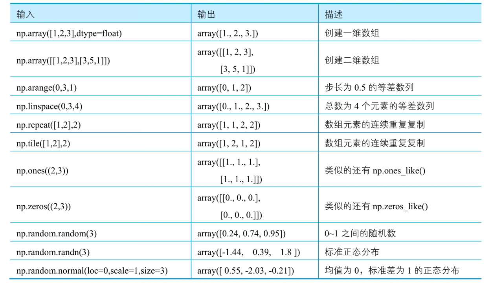

# 数据处理

## 2.1 NumPy：数值运算
NumPy，是高性能计算和数据分析的基础包。ndarray是NumPy的核心功能，其含义是n-dimensional array,即多维数组。  
数组与列表之间的主要区别为：  
* 数组是同类的，即所有元素必须具有相同的类型
* 列表可以包含任意类型的元素  
。使用NumPy的函数可以快速创建数组。NumPy在使用前需要导入
```python
import numpy as np
```

### 2.1 数组的创建
数组(ndarray)是由实际数据和描述这些数据的元素组成，可以使用*.shape查看数组的形状，使用*.dim查看数组的维数。  
而向量(vector)即一维数组，也是最常用的数组之一。  
通过NumPy的函数创建一维向量与二维数组常用的方法如下图所示。数组可由列表构造，也可以通过*.tolist方法转换列表

NumPy支持的数据类型有：bool、int8(-128~127的整数)、int16等。可以使用*.astype()函数实现对数组数据类型的转换。
                                                                  