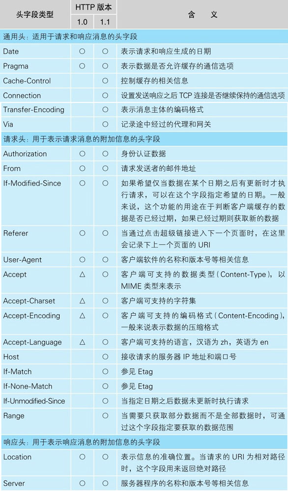

# 浏览器生成消息---探索浏览器内部
## 1.1 生成HTTP请求信息
### 1.1.1 网址
尽管通常使用浏览器来访问web服务器，但浏览器不只有一个功能，他也可以在FTP(文件传送协议)服务器上下载和上传
文件，同时也具备电子邮件客户端的功能。因此需要东西来判段使用哪种功能来访问相应的数据，不同的URL就是
干这个的。  
**URL的各种格式**  

### 1.1.2 浏览器要解析URL
**web浏览器解析URL的过程**  

### 1.1.3 省略文件名的情况
1. http://www.lab.glasscom.com/dir/  
以"/"结尾代表/dir/后面本来应该有的文件名被省略了。  
没有文件名，服务器怎么知道要访问哪个文件呢？其实，我们会在服务器上事先设置好文件名省略时要访问的默认文件名。
这个设置根据服务器不同而不同，多数情况下是index.html或者default.html之类的文件名。
2. http://www.lab.glasscom.com/
这个URL是以"/"结尾的，表示访问一个名叫"/"的目录。（根目录）
3. http://www.lab.glasscom.com
"/"也省略了。目录名也省略，就代表访问根目录下事先设置的默认文件，也就是/index.html或者/default.html
4. http://www.lab.glasscom.com/whatisthis
由于末尾没有"/"，所有whatisthis应该理解为文件名才对。但实际上，很多人没有正确理解省略文件
名的规则，经常把目录末尾的"/"也省略了。因此，不能总是将whatisthis作为文件名来处理。一般
这种情况按照下面惯例进行处理：如果web服务器上存在whatisthis的文件，则将whatisthis作为文件名
来处理；如果存在whatisthis的目录，则作为目录来处理。
**浏览器的第一步工作就是对URL进行解析**
### 1.1.4 HTTP的基本思路
解析完URL之后，我们 就知道要访问的目标在哪里了。接下来，浏览器会使用HTTP协议来访问Web服务器。  
  
请求信息中包含的内容是"对什么"和"进行怎样的操作"两部分。"对什么"的部分成为URI(统一资源标识符)。  
"进行怎样的操作"的部分成为方法。  

### 1.1.5 生成HTTP请求消息
  
浏览器和web服务器根据此格式来生产消息。准确来说，消息体的格式会通过消息头中的Content-Type字段来定义（MIME类型）  
**HTTP中主要的头字段**  

  
### 1.1.6 发送请求后会收到响应
**HTTP状态码概要**  
  
返回响应消息后，浏览器将数据提取出来显示在屏幕上，我们就能看到网页的样子了。如果网页内容只有文字，那么到这里
全部处理完毕了。如果还有图片等资源，则还有下文。  
当网页中包含图片时，会在网页中的相应位置嵌入表示图片文件的标签的控制信息。浏览器会在显示文字时搜索相应
的标签，当遇到图片相关的标签时，会在屏幕上留出用来显示图片的空间，然后再次访问web服务器，按照标签中指定的
文件名向web服务器请求获取相应图片并显示在预留空间中。  
**HTTP消息示例**  

## 1.2 向DNS服务器查询Web服务器的IP地址
### 1.2.1 IP地址的基本知识
生成HTTP消息之后，下一个步骤就是根据域名查询IP地址。  
**IP的基本思路**  

互联网和公司内部的局域网都是基于TCP/IP的思路来设计的。  
在网络中，所有的设备都会被分配一个地址。地址就相当于"xx号xx室"。其中"号"对应的号码是分配给整个子网的，"室"
对应的号码是分配给子网中的计算机的，这就是网络中的地址。  
"号"对应的号码称为网络号，"室"对应的号码称为主机号，这个地址的整体称为IP地址。  
**IP地址的表示方法**  
  
实际的IP地址是一串32比特的数字，按照8比特(1字节)为一组分成4组，分别用十进制表示然后再用圆点隔开。  
在IP地址的规则中，网络号和主机号连起来总共是32比特，但这两部分的具体结构是不固定的。在组建网络时，用户可以自行
决定它们之间的分配关系。因此，需要另外的附加信息来表示IP地址的内部结构。附加信息称为"子网掩码"。  
**子网掩码的格式**    
  
子网掩码的格式是一串与IP地址长度相同的32比特数字，其左边一半都是1，右边一半都是0。其中，子网掩码为1的部分
表示网络号，为0的部分表示主机号。  
主机号部分的比特全部为0或者全部为1时代表特殊的含义。全部为0代表整个子网而不是子网中的某台设备。全部为1代表
向子网上所有设备发送包，即广播。
### 1.2.2 域名和IP地址并用的理由
域名比IP地址容易记；IP地址长度为32比特，就是4字节，域名需要几十个字节，路由器处理IP地址负担轻
### 1.2.3 Socket库提供查询IP地址的功能
查询IP地址的方法非常简单，只要询问最近的DNS服务器。  
通过DNS查询IP地址的操作称为域名解析，因此负责执行解析这一操作的就叫**解析器**了。  
**解析器**实际上是一段程序，它包含在操作系统的Socket库中。库就是一堆通用程序组件的集合，其他的应用程序都需要使用其中的组件。
Socket库也是一种库，其中包含的程序组件可以让其他的应用程序调用操作系统的网络功能，而解析器就是这个库中的其中一种程序组件。  
Socket库中包含很多用于发送和接收数据的程序组件。是用于调用网络功能的程序组件集合。
### 1.2.4 通过解析器向DNS服务器发出查询
根据域名查询IP地址时，浏览器会使用Socket库中的解析器。
### 1.2.5 解析器的内部原理
**调用解析器时计算机内部的工作流程**  

## 1.3 全世界DNS服务器的大接力
### 1.3.1 DNS服务器的基本工作
DNS服务器的基本工作就是接收来自客户端的查询消息，然后根据消息的内容返回响应。

