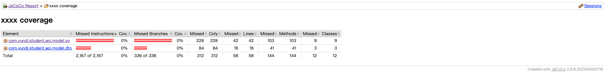
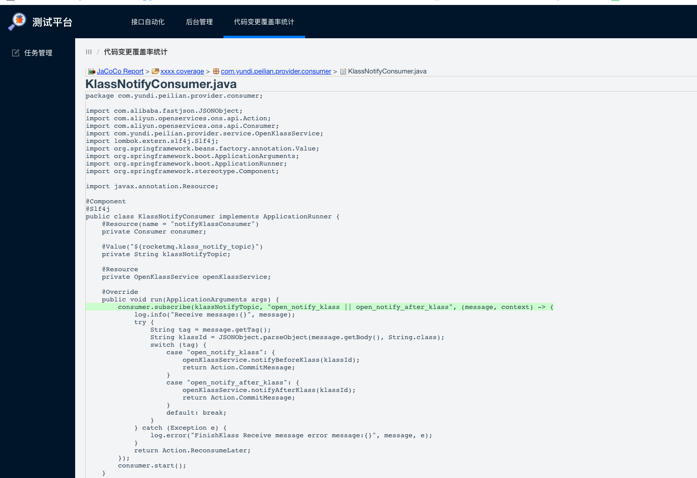

# 代码覆盖率
在频繁快速的迭代过程中，如何有效保证测试覆盖的充分性？是值得思考的问题。  
覆盖率是度量完整性的一个手段，目前引入了需求覆盖率，接下来希望可以引进代码覆盖率，通过覆盖率来评估测试是否充分
，开发提交的改动是否了解全面，从而更好的进行补充测试，提升上线的信心。
## JaCoCo简介
JaCoCo是一个开源的覆盖率工具，它针对的开发语言是java，其使用方法很灵活，可以嵌入到Ant、Maven中
### 插桩的本质
jacoco介入部署过程的本质，就是插桩。  
可以是编译时插桩、也可以是运行时插桩，这就是所谓Offline模式和On-the-fly模式。
### 两种模式区别
* On-The-Fly模式优点在于无需修改源代码，可以在系统不停机的情况下，实时收集代码覆盖率信息
* Offine模式优点在于系统启动不需要额外开启代理，但是只能在系统停机的情况下才能获取代码覆盖率  
**需要实时收集，所以这里选择On-The-Fly模式。**
### 本质
jacoco的on-the-fly模式的插桩过程，其实就是在测试环境部署的时候，让jacoco的相关工具，介入部署过程，也就是介入class文件的加载，
在加载class的时候，动态改变字节码结构，插入jacoco的探针。  
本质：jacoco 以 tcpserver 方式进行插桩的本质，就是如果应用启动过程中，进行了jacoco插桩，且成功了。它会在你当前这个启动服务器中，
在一个端口{$port}上，开启一个tcp服务，这个tcp服务，会一直接收jacoco的执行覆盖率信息并传到这个tcp服务上进行保存。  
再通俗将，其实就是介入下面这个命令的启动过程：
```
java -jar
```
### 不同形式的插桩配置
基于公司启动服务的方式，这里只介绍jar包方式启动时的配置
#### 使用jar包方式启动
在 java -jar 启动的时候，加入-javaagent 参数
```
-javaagent:/home/admin/jacoco/jacocoagent.jar=includes=*,output=tcpserver,port=2022,address=10.111.11.19

参数解释：
-javaagent：jdk5 之后新增的参数，主要用来在运行 jar 包的时候，以一种方式介入字节码加载过程
/home/admin/jacoco/jacocoagent.jar：需要用来介入 class 文件加载过程的 jar 包，是jar包的绝对路径
includes=*：这个代表了，启动时需要进行字节码插桩的包过滤，* 代表所有的 class 文件加载都需要进行插桩。如果有过滤可以写成：includes=com.task.*
output=tcpserver：这个地方不用改动，代表以 tcpserver 方式启动应用并进行插桩
port=2022：这是 jacoco 开启的 tcpserver 的端口，请注意这个端口不能被占用
address=10.111.11.19：这是对外开发的 tcpserver 的访问地址。可以配置 127.0.0.1,也可以配置为实际访问 ip
                      配置为 127.0.0.1 的时候，dump 数据只能在这台服务器上进行 dump，就不能通过远程方式 dump 数据。
                      配置为实际的 ip 地址的时候，就可以在任意一台机器上 (前提是 ip 要通)，通过 ant xml 或者 api 方式 dump 数据。
```
##### 实例
```
java -javaagent: $jacocoJarPath=includes=*,output=tcpserver,port=2022,address=10.111.11.19 -jar  xxxxxxxxxx.jar
注意，javaagent 参数，一定要在 jar 包路径之前，尽量在-jar 之前，不然可能不会生效。
```

## 覆盖率报告
上面这些的目的就是，为了启动服务时注入jacoco，开启tcp服务存放应用的执行覆盖率数据。  
可以粗暴的理解为：开启tcp服务后，后续的覆盖率统计，基本和这个测试环境没关系了。
基本了解jacoco的工作原理之后，开始生成覆盖率报告。  
生成报告三要素：  
* class文件
* 针对这些class文件产生的执行信息（就是exec文件）
* 源码
### 引入全量覆盖率
通过jenkins建立代码覆盖率任务，主要就是拉取源码、dump执行的覆盖率数据、生成测试报告（可以进行定时任务，定时
去dump获取exec文件）  
最终生成的测试报告，下图所示：  
  
这一步比较简单，网上很多教程。
### 代码变更覆盖率
全量的代码覆盖率意义并不大，因为要评估的每个迭代的测试情况，需要更精准的了解本次迭代的代码覆盖率情况，因此接下来
进行代码变更覆盖率。
#### 设计思路
服务端：python3+Django3  
前端：element-ui+vue，主要借助开源代码，照猫画虎，**感谢前端同学的帮助**。    
服务端：  
1、通过本次提交测试的commit和历史commit（比如正式环境的最后一次提交）进行差异比较。python有提供的三方git库。    
2、基于全量覆盖率报告，只对变更的文件显示  
前端：  
1、管理变更覆盖率任务  
2、展示变更覆盖率结果  
本地基本调通（基于yundi.peilian.provider进行的测试）。上图  
##### 任务列表
  
##### 变更覆盖率结果
  
##### 变更未覆盖详情
  
##### 变更已覆盖详情
