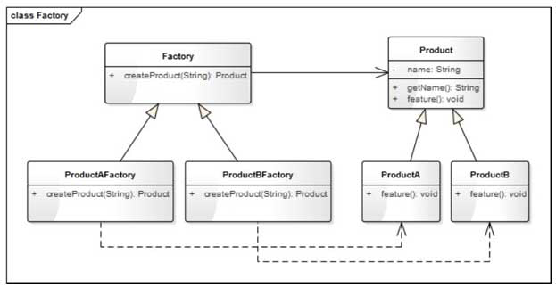
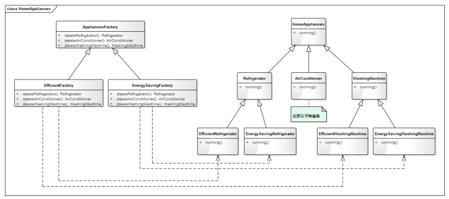
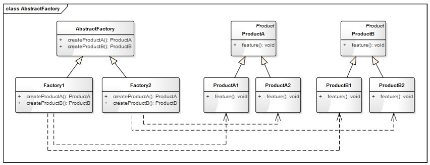

# 15 工厂模式
## 15.1 从生活中领悟工厂模式
### 15.1.1 要拿铁还是摩卡
### 15.1.2 程序模拟生活
```python
from abc import ABCMeta, abstractmethod

class Coffee(metaclass=ABCMeta):
    '''咖啡'''

    def __init__(self, name):
        self.__name = name

    def getName(self):
        return self.__name

    @abstractmethod
    def getTaste(self):
        pass

class LatteCoffee(Coffee):
    '''拿铁咖啡'''

    def __init__(self, name):
        super().__init__(name)

    def getTaste(self):
        return "轻柔而香醇"

class MochaCoffee(Coffee):
    '''摩卡咖啡'''

    def __init__(self, name):
        super().__init__(name)

    def getTaste(self):
        return "丝滑与醇厚"

class Coffeemaker:
    '''咖啡机'''

    @staticmethod
    def makeCoffee(coffeeBean):
        '''通过staticmethod装饰器来定义一个静态方法'''
        if coffeeBean == "拿铁咖啡豆":
            coffee = LatteCoffee("拿铁咖啡")
        elif coffeeBean == "摩卡咖啡豆":
            coffee = MochaCoffee("摩卡咖啡")
        else:
            raise ValueError(f"不支持的参数：{coffeeBean}")
        return coffee

latte = Coffeemaker.makeCoffee("拿铁咖啡豆")
print(f"{latte.getName()}已为您准备好了，口感{latte.getTaste()}，请慢慢享用")
mocha = Coffeemaker.makeCoffee("摩卡咖啡豆")
print(f"{mocha.getName()}已为您准备好了，口感{mocha.getTaste()}，请慢慢享用")

'''
拿铁咖啡已为您准备好了，口感轻柔而香醇，请慢慢享用
摩卡咖啡已为您准备好了，口感丝滑与醇厚，请慢慢享用
'''
```
## 15.2 从剧情中思考工厂模式
### 15.2.1 什么是简单工厂模式
专门定义一个类来负责创建其他类的实例，根据参数的不同创建不同的实例，被创建的实例通常具有共同的父类，
这个模式叫**简单工厂模式**。  
简单工厂模式又称为**静态工厂方法模式**。
### 15.2.2 工厂模式设计思想
我们通过咖啡机制作咖啡，加入不同风味的咖啡豆产生不同口味的咖啡。这一过程如同一个工厂一样
，加入不同配料，生产出不同的产品。这就是程序设计中**工厂模式**的概念。  
类图  
  
工厂模式中，用来创建对象的类就工厂类，被创建对象的类称为产品类。  
Coffeemaker是工厂类，LatteCoffee和MochaCoffee是产品类。  
## 15.3 工厂三姐妹
工厂模式三姐妹：简单工厂模式、工厂方法模式、抽象工厂模式。工厂方法模式是简单工厂模式的升级，抽象工厂模式又是工厂方法模式的升级。  
### 15.3.1 简单工厂模式
只有一个工厂类SimpleFactory,类中有一个静态的创建方法createProduct,该
方法根据参数传递过来的类型值(type)或名称(name)来创建具体的产品对象。  
1、定义  
定义一个创建对象（实例化对象）的接口，通过参数来决定创建哪个类的实例。  
2、类图  
  
SimpleFactory是工厂类，负责创建对象。Product是要创建产品的抽象类，负责定义统一的接口。ProductA、ProductB是具体的产品类型。   
3、优缺点  
优点：  
（1）实现简单、结构清晰  
（2）抽象出一个专门的类来负责某类对象的创建，分割出创建的职责，不能直接创建具体的对象，只需传入适当的参数即可。  
（3）使用者可以不关注具体对象的类名称，只需知道传入什么参数可以创建哪些需要的对象。  
缺点：  
（1）不易拓展，一旦增加新的产品类型，就的修改工厂的创建逻辑。不符合"开发封闭"原则。  
（2）当产品类型较多时，工厂的创建逻辑可能过于复杂。  
4、应用场景  
（1）产品具有明显的继承关系，且产品的类型不太多。  
（2）所有的产品具有相同的方法和类似的属性，使用者不关心具体的类型，只希望传入合适的参数能返回合适的对象。  
### 15.3.2 工厂方法模式
为解决简单工厂模式不符合"开放-封闭"原则的问题，我们对SimpleFactory进行了一个拆分，
抽象出一个父类Factory，并增加多个子类分别负责创建不同的具体产品。  
1、定义  
定义一个创建对象（实例化对象）的接口，让子类来决定创建哪个类的实例。工厂方法使一个类的实例化延迟到其子类。  
2、类图  
  
Factory是所有工厂的抽象类，负责统一的接口。ProductAFactory和ProductBFactory是具体的工厂类，
分别负责产品ProductA和ProductB的创建。  
3、优缺点  
优点：  
（1）解决了简单工厂模式不符合"开放-封闭"原则的问题，使程序更容易拓展。  
（2）实现简单。  
缺点：  
对于有多种分类的产品，或具有二级分类的产品，工厂方法模式并不适用。  
多种分类：如我们有一个电子白板程序，可以绘制各种图形，那画笔的绘制功能可以理解为一个工厂，而图形可以理解为一种产品，
图形可以根据形状分为直线、矩形等，也可根据颜色分为红色椭圆、蓝色椭圆  
二级分类：如一个家电工厂，它可能同时生产冰箱、空调，那冰箱、空调属于一级分类；而洗衣机又可分为高效型和节能型的，这属于二级分类。  
4、应用场景  
（1）客户端不知道它所需要的对象的类。  
（2）工厂类希望通过其子类来决定创建哪个具体类的对象。  
### 15.3.3 抽象工厂模式
抽象工厂模式是工厂方法模式的升级版本，工厂方法模式不能解决具有二级分类的产品创建问题，抽象工厂模式解决了此问题。  
1、定义  
提供一个创建一系列相关或相互依赖的对象的接口，而无需指定他们的具体类。  
2、类图  
之前提到的家电工厂的实现类图  
  
AppliancesFactory是一个抽象的工厂类，定义了三个方法，分别用来生产冰箱（Refrigerator）、空调（Air-conditioner）、洗衣机（WashingMachine）。
EfficientFactory和EnergySavingFactory是两个具体的工厂类，分别用来生产高效型的家电和节能型的家电。  
我们进一步抽象出抽象工厂模式的类图，  
  
抽象工厂模式适用于有多个系列且每个系列有相同子分类的产品。我们定义一个抽象的工厂类AbstractFactory,AbstractFactory中定义生产每个系列产品的方法；
而两个具体的工厂实现类Factory1和Factory2分别生产子分类1的每一系列产品和子分类2的每一系列产品。  

如前面的例子，有冰箱、空调、洗衣机三个系列的产品，每个系列都有相同的子分类，即高效型和节能型。通过抽象
工厂模式的类图我们知道Refrigerator、Air-conditioner、WashingMachine其实也可以不继承自HomeAppliances,
因为可以把他们看出独立的系列。在真实的项目中要根据应用场景而定，如果这三种家电有很多相同的属性，可以抽象出一个父类HomeAppliances，
如果差别很大则没有必要。  
3、优缺点  
优点：  
解决了具有二级分类的产品的创建。  
缺点：  
（1）如果产品的分类超过二级，抽象工厂模式将变得臃肿。  
（2）不能解决产品有多种分类、多种组合的问题。  
4、应用场景  
（1）系统中有多于一个的产品族，而每次只使用其中某一个产品族。  
（2）产品等级结构稳定，设计完成之后，不会向系统中增加新的产品等级结构或者删除已有的产品等级结构。  
## 15.4 进一步思考
如果产品出现三级或更多分类怎么办？如果程序中出现了三级分类的对象，需要重新审视你的设计，看有些
分类是不是可以进行归纳、抽象合并。如果实际应用中确实有，建议不使用工厂模式，直接交给每一个具体的产品类
自己去创建。  
## 15.5 实战应用
在众多的在线教育产品和视频教学产品中都会有一个白板功能，白板功能中需要不同类型的画笔，比如直线、距形、椭圆等，
但在一个白板中我们只需要一只笔。可以对简单工厂模式进行一些修改已满足需求。  
```python
from abc import ABCMeta, abstractmethod
from enum import Enum

class PenType(Enum):
    '''画笔类型'''
    PenTypeLine = 1
    PenTypeRect = 2
    PenTypeEllipse = 3

class Pen(metaclass=ABCMeta):
    '''画笔'''

    def __init__(self, name):
        self.__name = name

    @abstractmethod
    def getType(self):
        pass

    def getName(self):
        return self.__name

class LinePen(Pen):
    '''直线画笔'''

    def __init__(self, name):
        super().__init__(name)

    def getType(self):
        return PenType.PenTypeLine

class RectanglePen(Pen):
    '''矩形画笔'''

    def __init__(self, name):
        super().__init__(name)

    def getType(self):
        return PenType.PenTypeRect

class EllipsePen(Pen):
    '''椭圆画笔'''

    def __init__(self, name):
        super().__init__(name)

    def getType(self):
        return PenType.PenTypeEllipse

class PenFactory:
    '''画笔工厂类'''

    def __init__(self):
        # 定义一个字典(key:PenType, value:Pen)来存放对象，确保每一个类型只会有一个对象
        self.__pens = {}

    def getSingleObj(self, penType, name):
        """获得唯一实例的对象"""
        pass

    def createPen(self, penType):
        '''创建画笔'''
        if self.__pens.get(penType) is None:
            # 如果对象不存在，则创建一个对象并存到字典中
            if penType == PenType.PenTypeLine:
                pen = LinePen("直线画笔")
            elif penType == PenType.PenTypeRect:
                pen = RectanglePen("矩形画笔")
            elif penType == PenType.PenTypeEllipse:
                pen = EllipsePen("椭圆画笔")
            else:
                pen = Pen("")
            self.__pens[penType] = pen
        # 否则直接返回字典中的对象
        return self.__pens[penType]

factory = PenFactory()
linePen = factory.createPen(PenType.PenTypeLine)
print(f"创建了{linePen.getName()},对象id:{id(linePen)},类型:{linePen.getType()}")
rectPen = factory.createPen(PenType.PenTypeRect)
print(f"创建了{rectPen.getName()},对象id:{id(rectPen)},类型:{rectPen.getType()}")
rectPen2 = factory.createPen(PenType.PenTypeRect)
print(f"创建了{rectPen2.getName()},对象id:{id(rectPen2)},类型:{rectPen2.getType()}")
ellipsePen = factory.createPen(PenType.PenTypeEllipse)
print(f"创建了{ellipsePen.getName()},对象id:{id(ellipsePen)},类型:{ellipsePen.getType()}")
'''
创建了直线画笔,对象id:4486953328,类型:PenType.PenTypeLine
创建了矩形画笔,对象id:4486953568,类型:PenType.PenTypeRect
创建了矩形画笔,对象id:4486953568,类型:PenType.PenTypeRect
创建了椭圆画笔,对象id:4486952848,类型:PenType.PenTypeEllipse
'''
```
上述源码中，我们创建了两次矩形画笔的对象rectPen和rectPen2，但这两个变量指向的是同一个对象，因为对象
的ID一样。说明通过这种方式我们实现了每一个类型只创建一个对象的功能。  
