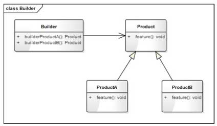
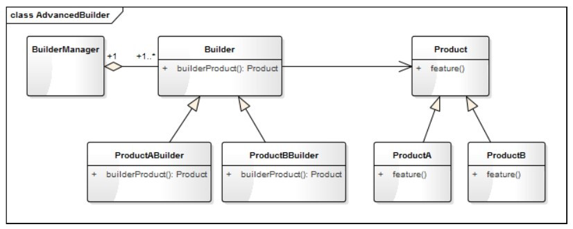

# 设计模式

## 12 构建模式（生成器模式）
```python
# 引入ABCMeta 和 abstractmethod 来定义抽象类和抽象方法
from abc import ABCMeta, abstractmethod

class Toy(metaclass=ABCMeta):
    '''玩具'''

    def __init__(self, name):
        self._name = name
        self.__components = []

    def getName(self):
        return self._name

    def addComponent(self, component, count = 1, unit = "个"):
        self.__components.append([component, count, unit])
        print(f"{self._name}增加了{count}{unit}{component}")

    @abstractmethod
    def feature(self):
        pass

class Car(Toy):
    '''小车'''

    def feature(self):
        print(f"我是{self._name}，我可以快速奔跑---")

class Manor(Toy):
    '''庄园'''

    def feature(self):
        print(f"我是{self._name}，我可以提供观赏---")

class ToyBuilder:
    '''玩具构建者'''

    def buildCar(self):
        car = Car("迷你小车")
        print(f"正在构建{car.getName()}")
        car.addComponent("轮子", 4)
        car.addComponent("车身", 1)
        car.addComponent("发动机", 1)
        car.addComponent("方向盘")
        return car

    def buildManor(self):
        manor = Manor("涛涛小庄园")
        print(f"正在构建{manor.getName()}")
        manor.addComponent("客厅", 1, "间")
        manor.addComponent("卧室", 2, "间")
        manor.addComponent("书房", 1, "间")
        manor.addComponent("厨房", 1, "间")
        manor.addComponent("花园", 1, "个")
        manor.addComponent("围墙", 1, "堵")
        return manor

def testBuilder():
    builder = ToyBuilder()
    car = builder.buildCar()
    car.feature()
    print()
    mannor = builder.buildManor()
    mannor.feature()
```
### 12.2
#### 12.2.1 什么是构建模式
将一复杂对象的构建过程和他的表现分离，使得同样的构建过程可以获取（创建）不同的表现。
#### 12.2.2 构建模式设计思想
* 像搭积木一样，把不同的部件拼装成自己想要的东西的过程，就是一个构建过程。  
* 构建顾名思义就是把各种部件通过一定的方式和流程构造成一个产品的过程。在程序中，我们将这一过程称为**构建模式**，有的也叫**建造者模式**或**生成器模式**  
* 构建模式的核心思想是：将产品的创建过程与产品本身分离开来，使得创建过程更加清晰，能够更加精确地控制复杂对象的创建过程，让使用者可以用相同的创建过程创建不同的产品。

### 12.3 构建模式的模型抽象
#### 12.3.1 类图
构建模式是一个产品或对象的生成器，强调产品的构建过程，精简版构建模式的类图如图所示  
  
* Builder就是一个构建者，如故事剧情中的ToyBuilder。
* Product是要构建成的目标产品的基类，如故事剧情中的Toy。
* ProductA是具体产品类型，如故事剧情中的Car和Manor。
* ToyBuilder通过不同的积木模块和建造顺序，可以建造出不同的车和庄园  
如果应用场景更复杂，如：Toy不只有车和庄园 ，还有飞机、坦克、摩天轮、过山车等，而且不只造一辆车和一个庄园 ，数量由孩子自己定。上面这个ToyBuilder就会变得越来越臃肿。
此时，需要升级版构建模式的类图，如图所示  
    
* BuilderManager是构建类的管理类，负责管理每一种产品的创建数量和创建顺序
* Builder是抽象构建类，ProductABuilder和ProductBBuilder是对应产品的具体构建类
* Product是产品的抽象类（基类），ProductA和ProductB是具体的产品

#### 12.3.2 基于框架的实现
升级之前的代码  
```python
# 引入ABCMeta 和 abstractmethod 来定义抽象类和抽象方法
from abc import ABCMeta, abstractmethod

class Toy(metaclass=ABCMeta):
    '''玩具'''

    def __init__(self, name):
        self._name = name
        self.__components = []

    def getName(self):
        return self._name

    def addComponent(self, component, count = 1, unit = "个"):
        self.__components.append([component, count, unit])
        print(f"{self._name}增加了{count}{unit}{component}")

    @abstractmethod
    def feature(self):
        pass

class Car(Toy):
    '''小车'''

    def feature(self):
        print(f"我是{self._name}，我可以快速奔跑---")

class Manor(Toy):
    '''庄园'''

    def feature(self):
        print(f"我是{self._name}，我可以提供观赏---")

class ToyBuilder(metaclass=ABCMeta):
    '''玩具构建者'''

    @abstractmethod
    def buildProduct(self):
        pass

class CarBuilder(ToyBuilder):
    '''车的构建类'''

    def buildProduct(self):
        car = Car("迷你小车")
        print(f"正在构建{car.getName()}")
        car.addComponent("轮子", 4)
        car.addComponent("车身", 1)
        car.addComponent("发动机", 1)
        car.addComponent("方向盘")
        return car

class ManorBuilder(ToyBuilder):
    '''庄园的构建类'''

    def buildProduct(self):
        manor = Manor("涛涛小庄园")
        print(f"正在构建{manor.getName()}")
        manor.addComponent("客厅", 1, "间")
        manor.addComponent("卧室", 2, "间")
        manor.addComponent("书房", 1, "间")
        manor.addComponent("厨房", 1, "间")
        manor.addComponent("花园", 1, "个")
        manor.addComponent("围墙", 1, "堵")
        return manor


class BuilderMgr:
    '''构建者的管理类'''

    def __init__(self):
        self.__CarBuilder = CarBuilder()
        self.__ManorBuilder = ManorBuilder()

    def buildCar(self, num):
        count = 0
        products = []
        while(count < num):
            car = self.__CarBuilder.buildProduct()
            products.append(car)
            count += 1
            print(f"建造完成第{count}辆{car.getName()}")
        return products

    def buildManor(self, num):
        count = 0
        products = []
        while (count < num):
            manor = self.__ManorBuilder.buildProduct()
            products.append(manor)
            count += 1
            print(f"建造完成第{count}个{manor.getName()}")
        return products


def testAdvanceBuilder():
    builderMgr = BuilderMgr()
    builderMgr.buildManor(2)
    print()
    builderMgr.buildCar(4)
```
#### 12.3.3 模型说明
1. 设计要点  
构建模式（升级版）中主要有三个角色，在设计构建模式时要找到并区分这些角色。  
* 产品（Product）：即你要构建的对象
* 构建者（Builder）：构建模式的核心类，负责产品的构建过程
* 指挥官（BuilderManager）：构建的管理类。负责管理每一种产品的创建数量和创建顺序  

2. 构建模式的优缺点  
* 将产品（对象）的创建过程与产品（对象）本身分离开来，让使用方（调用者）可以用相同的创建过程创建不同的产品（对象）。
* 将对象的创建过程单独分解出来，使得创建过程更加清晰，能够更加精确的控制复杂对象的创建过程
* 针对升级版的构建模式，每一个具体构建者相对独立，而与其他的具体构建者无关，因此可以很方便的替换具体构建者或增加新的具体构建者  

**缺点**：  
* 增加了很多创建类，如果产品的类型和种类比较多，将会增加很多类，使整个系统变得更加庞杂
* 产品之间的结构相差很大时，构建模式将很难适应