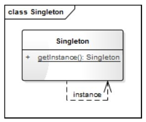
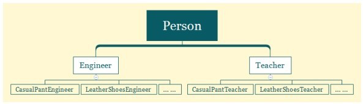
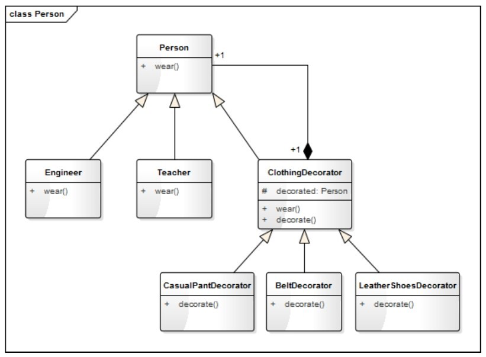
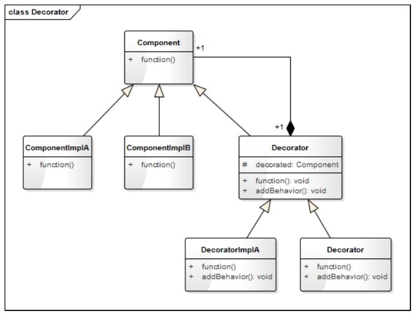
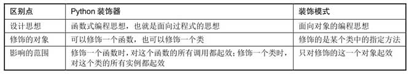

# 设计模式

## 12 构建模式（生成器模式）
```python
# 引入ABCMeta 和 abstractmethod 来定义抽象类和抽象方法
from abc import ABCMeta, abstractmethod

class Toy(metaclass=ABCMeta):
    '''玩具'''

    def __init__(self, name):
        self._name = name
        self.__components = []

    def getName(self):
        return self._name

    def addComponent(self, component, count = 1, unit = "个"):
        self.__components.append([component, count, unit])
        print(f"{self._name}增加了{count}{unit}{component}")

    @abstractmethod
    def feature(self):
        pass

class Car(Toy):
    '''小车'''

    def feature(self):
        print(f"我是{self._name}，我可以快速奔跑---")

class Manor(Toy):
    '''庄园'''

    def feature(self):
        print(f"我是{self._name}，我可以提供观赏---")

class ToyBuilder:
    '''玩具构建者'''

    def buildCar(self):
        car = Car("迷你小车")
        print(f"正在构建{car.getName()}")
        car.addComponent("轮子", 4)
        car.addComponent("车身", 1)
        car.addComponent("发动机", 1)
        car.addComponent("方向盘")
        return car

    def buildManor(self):
        manor = Manor("涛涛小庄园")
        print(f"正在构建{manor.getName()}")
        manor.addComponent("客厅", 1, "间")
        manor.addComponent("卧室", 2, "间")
        manor.addComponent("书房", 1, "间")
        manor.addComponent("厨房", 1, "间")
        manor.addComponent("花园", 1, "个")
        manor.addComponent("围墙", 1, "堵")
        return manor

def testBuilder():
    builder = ToyBuilder()
    car = builder.buildCar()
    car.feature()
    print()
    mannor = builder.buildManor()
    mannor.feature()
```
### 12.2
#### 12.2.1 什么是构建模式
将一复杂对象的构建过程和他的表现分离，使得同样的构建过程可以获取（创建）不同的表现。
#### 12.2.2 构建模式设计思想
* 像搭积木一样，把不同的部件拼装成自己想要的东西的过程，就是一个构建过程。  
* 构建顾名思义就是把各种部件通过一定的方式和流程构造成一个产品的过程。在程序中，我们将这一过程称为**构建模式**，有的也叫**建造者模式**或**生成器模式**  
* 构建模式的核心思想是：将产品的创建过程与产品本身分离开来，使得创建过程更加清晰，能够更加精确地控制复杂对象的创建过程，让使用者可以用相同的创建过程创建不同的产品。

### 12.3 构建模式的模型抽象
#### 12.3.1 类图
构建模式是一个产品或对象的生成器，强调产品的构建过程，精简版构建模式的类图如图所示  
  
* Builder就是一个构建者，如故事剧情中的ToyBuilder。
* Product是要构建成的目标产品的基类，如故事剧情中的Toy。
* ProductA是具体产品类型，如故事剧情中的Car和Manor。
* ToyBuilder通过不同的积木模块和建造顺序，可以建造出不同的车和庄园  
如果应用场景更复杂，如：Toy不只有车和庄园 ，还有飞机、坦克、摩天轮、过山车等，而且不只造一辆车和一个庄园 ，数量由孩子自己定。上面这个ToyBuilder就会变得越来越臃肿。
此时，需要升级版构建模式的类图，如图所示  
    
* BuilderManager是构建类的管理类，负责管理每一种产品的创建数量和创建顺序
* Builder是抽象构建类，ProductABuilder和ProductBBuilder是对应产品的具体构建类
* Product是产品的抽象类（基类），ProductA和ProductB是具体的产品

#### 12.3.2 基于框架的实现
升级之前的代码  
```python
# 引入ABCMeta 和 abstractmethod 来定义抽象类和抽象方法
from abc import ABCMeta, abstractmethod

class Toy(metaclass=ABCMeta):
    '''玩具'''

    def __init__(self, name):
        self._name = name
        self.__components = []

    def getName(self):
        return self._name

    def addComponent(self, component, count = 1, unit = "个"):
        self.__components.append([component, count, unit])
        print(f"{self._name}增加了{count}{unit}{component}")

    @abstractmethod
    def feature(self):
        pass

class Car(Toy):
    '''小车'''

    def feature(self):
        print(f"我是{self._name}，我可以快速奔跑---")

class Manor(Toy):
    '''庄园'''

    def feature(self):
        print(f"我是{self._name}，我可以提供观赏---")

class ToyBuilder(metaclass=ABCMeta):
    '''玩具构建者'''

    @abstractmethod
    def buildProduct(self):
        pass

class CarBuilder(ToyBuilder):
    '''车的构建类'''

    def buildProduct(self):
        car = Car("迷你小车")
        print(f"正在构建{car.getName()}")
        car.addComponent("轮子", 4)
        car.addComponent("车身", 1)
        car.addComponent("发动机", 1)
        car.addComponent("方向盘")
        return car

class ManorBuilder(ToyBuilder):
    '''庄园的构建类'''

    def buildProduct(self):
        manor = Manor("涛涛小庄园")
        print(f"正在构建{manor.getName()}")
        manor.addComponent("客厅", 1, "间")
        manor.addComponent("卧室", 2, "间")
        manor.addComponent("书房", 1, "间")
        manor.addComponent("厨房", 1, "间")
        manor.addComponent("花园", 1, "个")
        manor.addComponent("围墙", 1, "堵")
        return manor


class BuilderMgr:
    '''构建者的管理类'''

    def __init__(self):
        self.__CarBuilder = CarBuilder()
        self.__ManorBuilder = ManorBuilder()

    def buildCar(self, num):
        count = 0
        products = []
        while(count < num):
            car = self.__CarBuilder.buildProduct()
            products.append(car)
            count += 1
            print(f"建造完成第{count}辆{car.getName()}")
        return products

    def buildManor(self, num):
        count = 0
        products = []
        while (count < num):
            manor = self.__ManorBuilder.buildProduct()
            products.append(manor)
            count += 1
            print(f"建造完成第{count}个{manor.getName()}")
        return products


def testAdvanceBuilder():
    builderMgr = BuilderMgr()
    builderMgr.buildManor(2)
    print()
    builderMgr.buildCar(4)
```
#### 12.3.3 模型说明
1. 设计要点  
构建模式（升级版）中主要有三个角色，在设计构建模式时要找到并区分这些角色。  
* 产品（Product）：即你要构建的对象
* 构建者（Builder）：构建模式的核心类，负责产品的构建过程
* 指挥官（BuilderManager）：构建的管理类。负责管理每一种产品的创建数量和创建顺序  

2. 构建模式的优缺点  
* 将产品（对象）的创建过程与产品（对象）本身分离开来，让使用方（调用者）可以用相同的创建过程创建不同的产品（对象）。
* 将对象的创建过程单独分解出来，使得创建过程更加清晰，能够更加精确的控制复杂对象的创建过程
* 针对升级版的构建模式，每一个具体构建者相对独立，而与其他的具体构建者无关，因此可以很方便的替换具体构建者或增加新的具体构建者  

**缺点**：  
* 增加了很多创建类，如果产品的类型和种类比较多，将会增加很多类，使整个系统变得更加庞杂
* 产品之间的结构相差很大时，构建模式将很难适应

## 5 单例模式
```python
class MyBeautifulGril:
    """漂亮女神"""
    __instance = None
    __isFirstInit = False

    def __new__(cls, name):
        if not  cls.__instance:
            MyBeautifulGril.__instance = super().__new__(cls)
        return cls.__instance

    def __init__(self, name):
        if not self.__isFirstInit:
            self.__name = name
            print("遇见" + name + ",我一见钟情！")
            MyBeautifulGril.__isFirstInit = True
        else:
            print("遇见" + name + ",我置若罔闻！")

    def showMyHeart(self):
        print(self.__name + "就是我心中的唯一！")


jenny = MyBeautifulGril("Jenny") # 遇见Jenny,我一见钟情！
jenny.showMyHeart() # Jenny就是我心中的唯一！
kimi = MyBeautifulGril("Kimi") # 遇见Kimi,我置若罔闻！
kimi.showMyHeart() # Jenny就是我心中的唯一！
print("id(jenny):", id(jenny), "id(kimi):", id(kimi)) # id(jenny): 140460581871232 id(kimi): 140460581871232
```
### 5.2 思考单例模式
#### 5.2.1 什么是单例模式
确保一个类只有一个实例，并且提供一个访问它的全局方法
#### 5.2.2 单例模式设计思想
有一些类，你希望他的实例是唯一的。  
单例模式就是保证一个类有且只有一个对象（实例）的一种机制。
### 5.3 单例模式的模型对象
#### 5.3.1 代码框架
实现方式有很多种  
1. 重写__new__和__init__方法  
```python
class Singleton1:
    """单例实现方式一 """
    __instance = None
    __isFirstInit = False

    def __new__(cls, name):
        if not  cls.__instance:
            Singleton1.__instance = super().__new__(cls)
        return cls.__instance

    def __init__(self, name):
        if not self.__isFirstInit:
            self.__name = name
            Singleton1.__isFirstInit = True
       
    def getName(self):
        return self.__name


jenny = Singleton1("Jenny")
kimi = Singleton1("Kimi")
print(jenny.getName(), kimi.getName()) # Jenny Jenny
print("id(jenny):", id(jenny), "id(kimi):", id(kimi)) # id(jenny): 140576084614784 id(kimi): 140576084614784
print("jenny == kimi", jenny == kimi) # jenny == kimi True
```
我们定义了一个静态的__instance类变量，用来存放Singleton1的对象，__new__方法每次返回同一个__instance对象（若未初始化，则进行初始化）。  
__isFirstInit作用确保只对__instance对象进行一次初始化。  
2、 自定义metaclass的方法  
```python
class Singleton(type):
    '''单例实现方式二'''

    def __init__(cls, what, bases=None, dict=None):
        super().__init__(what, bases, dict)
        cls._instance = None # 初始化全局变量cls._instance为None

    def __call__(cls, *args, **kwargs):
        # 控制对象的创建过程，如果cls._instance为None，则创建，否则直接返回
        if cls._instance is None:
            cls._instance = super().__call__(*args, **kwargs)
        return cls._instance

class CustomClass(metaclass=Singleton):
    '''用户自定义的类'''
    def __init__(self, name):
        self.__name = name

    def getName(self):
        return self.__name

tony = CustomClass("Tony")
karry = CustomClass("karry")
print(tony.getName(), karry.getName()) # Tony Tony
print("id(tony):",id(tony), "id(karry):", id(karry)) # id(tony): 140202384711296 id(karry): 140202384711296
print("tony == karry:",tony == karry) # tony == karry: True
```
我们定义了metaclass（Singleton）来控制对象的实例化过程。  
3、装饰器的方法  
```python
def singleDecorator(cls, *args, **kwargs):
    '''定义一个单例装饰器'''
    instance = {}

    def wrapperSingleton(*args, **kwargs):
        if cls not in instance:
            instance[cls] = cls(*args, **kwargs)
        return instance[cls]

    return wrapperSingleton

@singleDecorator
class Singleton:
    '''使用但例装饰器修饰一个类'''
    def __init__(self, name):
        self.__name = name

    def getName(self):
        return self.__name

tony = Singleton("Tony")
karry = Singleton("karry")
print(tony.getName(), karry.getName()) # Tony Tony
print("id(tony):",id(tony), "id(karry):", id(karry)) # id(tony): 140540364732160 id(karry): 140540364732160
print("tony == karry:",tony == karry) # tony == karry: True
```
装饰器的实质就是对传进来的参数进行补充，可以在不对原有的类做任何代码变动的前提下增加额外的功能，使用装饰器可以装饰多个类。  
#### 5.3.2 类图
  
类图很简单，只有一个类，类中只有一个方法，getInstance()的作用就是获取该类的唯一实例。  
#### 5.3.3 基于框架的实现
```python
def singleDecorator(cls, *args, **kwargs):
    '''定义一个单例装饰器'''
    instance = {}

    def wrapperSingleton(*args, **kwargs):
        if cls not in instance:
            instance[cls] = cls(*args, **kwargs)
        return instance[cls]

    return wrapperSingleton

@singleDecorator
class MyBeautifulGril:
    """漂亮女神"""

    def __init__(self, name):
        self.__name = name
        if self.__name == name:
            print("遇见" + name + ",我一见钟情！")
        else:
            print("遇见" + name + ",我置若罔闻！")

    def showMyHeart(self):
        print(self.__name + "就是我心中的唯一！")


jenny = MyBeautifulGril("Jenny") # 遇见Jenny,我一见钟情！
jenny.showMyHeart() # Jenny就是我心中的唯一！
kimi = MyBeautifulGril("Kimi") 
kimi.showMyHeart() # Jenny就是我心中的唯一！
print("id(jenny):", id(jenny), "id(kimi):", id(kimi)) # id(jenny): 140499525842736 id(kimi): 140499525842736

```
### 5.4 应用场景
（1）希望这个类只有一个且只能有一个实例  
（2）项目中的一些全局管理类（Manager）可以用单例模式来实现

# 4 装饰模式
```python
from abc import ABCMeta, abstractmethod
# 引入ABCMeta和abstractmethod来定义抽象类和抽象方法

class Person(metaclass=ABCMeta):
    '''人'''

    def __init__(self, name):
        self._name = name

    @abstractmethod
    def wear(self):
        print("着装：")


class Engineer(Person):
    '''工程师'''

    def __init__(self, name, skill):
        super().__init__(name)
        self.__skill = skill

    def getSkill(self):
        return self.__skill

    def wear(self):
        print("我是 " + self.getSkill() + "工程师 " + self._name, end=',')
        super().wear()


class Teacher(Person):
    '''教师'''

    def __init__(self, name, title):
        super().__init__(name)
        self.__title = title

    def getTitle(self):
        return self.__title

    def wear(self):
        print("我是 " + self._name + self.getTitle(), end=',')
        super().wear()


class ClothingDecorator(Person):
    '''服装装饰器的基类'''

    def __init__(self, person):
        self._decorated = person

    def wear(self):
        self._decorated.wear()
        self.decorate()

    @abstractmethod
    def decorate(self):
        pass


class CasualPantDecorator(ClothingDecorator):
    '''休闲裤装饰器'''

    def __init__(self, person):
        super().__init__(person)

    def decorate(self):
        print("一条卡其色休闲裤")


class BeltDecorator(ClothingDecorator):
    '''腰带装饰器'''

    def __init__(self, person):
        super().__init__(person)

    def decorate(self):
        print("一条银色针扣头的黑色腰带")


class LeatherShoesDecorator(ClothingDecorator):
    '''皮鞋装饰器'''

    def __init__(self, person):
        super().__init__(person)

    def decorate(self):
        print("一双深色休闲皮鞋")


class KnittedSwwaterDecorator(ClothingDecorator):
    '''针织毛衣装饰器'''

    def __init__(self, person):
        super().__init__(person)

    def decorate(self):
        print("一件紫红色针织毛衣")


class WhiteShirtDecorator(ClothingDecorator):
    '''白色衬衫装饰器'''

    def __init__(self, person):
        super().__init__(person)

    def decorate(self):
        print("一件白色衬衫")


class GlassesDecorator(ClothingDecorator):
    '''眼镜装饰器'''

    def __init__(self, person):
        super().__init__(person)

    def decorate(self):
        print("一副方形黑框眼睛")

tony = Engineer("Tony", "客户端")
pant = CasualPantDecorator(tony)
belt = BeltDecorator(pant)
shoes = LeatherShoesDecorator(belt)
shirt = WhiteShirtDecorator(shoes)
sweater = KnittedSwwaterDecorator(shirt)
glasses = GlassesDecorator(sweater)
glasses.wear()
print()
decorateTeacher = GlassesDecorator(WhiteShirtDecorator(LeatherShoesDecorator(Teacher("wells", "教授")))) # 优雅的写法
decorateTeacher.wear()

'''
我是 客户端工程师 Tony,着装：
一条卡其色休闲裤
一条银色针扣头的黑色腰带
一双深色休闲皮鞋
一件白色衬衫
一件紫红色针织毛衣
一副方形黑框眼睛

我是 wells教授,着装：
一双深色休闲皮鞋
一件白色衬衫
一副方形黑框眼睛
'''

```
由上可以看出，同一套服装穿在了不同人身上
### 4.2 思考装饰模式
#### 4.2.1 什么是装饰模式
动态的给一个对象增加一些额外的职责，就拓展对象功能来说，装饰模式比生成子类的方式更为灵活。  
就故事剧情中示例来说，由结构庞大的子类继承关系转换成了结构紧凑的装饰关系。  
  

#### 4.2.2 装饰模式设计思想
生活中的着装问题（想怎么搭怎么搭），就是程序中装饰模式的典型样例。  
### 4.3 装饰模式的模型抽象
#### 4.3.1 类图
  
图中Component是一个抽象类，代表具有某种功能（function）的组件，ComponentImplA和ComponentImplB分别是其具体的实现类。Decorator是
Component的装饰器，里面有一个Component的对象decorated,这就是被装饰的对象，装饰器可为被装饰对象添加额外的功能和行为（addBehavior）.
DecoratorImplA和DecoratorImplB分别是两个具体的装饰器（实现子类）。   
这样一种模式很好的将装饰器与被装饰的对象进行了解耦。  
#### 4.3.2 python中的装饰器
python中一切都是对象。在python中，可以将一个函数作为参数传递给另一个函数，也可以将一个类作为参数传递给一个函数  
（1）python中函数的特殊功能  
函数作为参数传递给另一个函数，也可以在函数中返回一个函数，还可以在函数内部再定义函数。这是和很多静态语言不同的地方。  
```python
def func(num):
    '''定义内部函数并返回'''

    def firstInnerFunc():
        return "这是第一个内部函数"

    def secondInnerFunc():
        return "这是第二个内部函数"

    if num == 1:
        return firstInnerFunc
    else:
        return secondInnerFunc

print(func(1)) # <function func.<locals>.firstInnerFunc at 0x7fa173ba01f0>
print(func(2)) # <function func.<locals>.secondInnerFunc at 0x7fa173ba0310>
print(func(1)()) # 这是第一个内部函数
print(func(2)()) # 这是第二个内部函数
```
（2）装饰器修饰函数  
装饰器的作用：包装一个函数，并改变（拓展）它的行为。  
假设有这样一个需求：我们希望每一个函数在被调用之前和被调用之后，记录一条日志。 
```python
import logging

logging.basicConfig(level=logging.INFO)

def loggingDecorator(func):
    '''记录日志的装饰器'''
    def wrapperLogging(*args, **kwargs):
        logging.info(f"开始执行{func.__name__}...")
        func(*args, **kwargs)
        logging.info(f"{func.__name__}执行完成！")
    return wrapperLogging

def showInfo(*args, **kwargs):
    print("这是一个测试函数，参数：", args, kwargs)

decoratedShowInfo = loggingDecorator(showInfo)
decoratedShowInfo('arg1', 'arg2', kwarg1 = 1, kwarg2 = 2)

'''
这是一个测试函数，参数： ('arg1', 'arg2') {'kwarg1': 1, 'kwarg2': 2}
INFO:root:开始执行showInfo...
INFO:root:showInfo执行完成！
'''

``` 
我们在loggingDecorator中定义了一个内部函数wrapperLogging，用于在传入的函数中执行前后记录日志，一般称这个函数为包装函数，并在最后返回这个函数。
我们称loggingDecorator为装饰器。  
有没有发现，每次调用一个函数需要写两行代码，这是非常繁琐的，python有更简单的方式，@decorator语法  
```
@loggingDecorator
def showInfo(*args, **kwargs):
    print("这是一个测试函数，参数：", args, kwargs)
``` 
（3）装饰器修饰类  
装饰器可以是一个函数，也可以是一个类（必须要实现__call__方法，使其是callable的）。同时装饰器不仅可以修改一个函数，还可以修饰一个类，示例如下  
```python
class ClassDecorator:
    '''类装饰器，记录一个类被实例化的次数'''

    def __init__(self, func):
        self.__numOfCall = 0
        self.__func = func

    def __call__(self, *args, **kwargs):
        self.__numOfCall += 1
        obj = self.__func(*args, **kwargs)
        print(f"创建{self.__func.__name__}的第{self.__numOfCall}个实例，{id(obj)}")
        return obj

@ClassDecorator
class MyClass:

     def __init__(self, name):
         self.__name = name

     def getName(self):
         return self.__name

tony = MyClass("Tony")  # 创建MyClass的第1个实例，140611254899232
karry = MyClass("Karry") # 创建MyClass的第2个实例，140611254761024
print(id(tony)) # 140611254899232
print(id(karry)) # 140611254761024
```
这里的ClassDecorator是类装饰器，记录一个类被实例化的次数。其修饰一个类和修饰一个函数的用法是一样的，只需在定义类时@ClassDecorator即可。  
#### 4.3.3 模型说明
* 设计要点  
（1）可灵活的给一个对象增加职责或拓展功能。你可任意地穿上自己想穿的衣服。不管穿上什么衣服，你还是那个你，但穿上不同的衣服你就会有不同的外表。    
（2）可增加任意多个装饰。你可以只穿一条裤子，也可以混蛋，随意。  
（3）装饰的顺序不同，可能产生不同的效果。在上面的示例中，tony把针织毛衣穿在外面，白色衬衫穿在里面。当然如果愿意，也可以里外换着穿。  
使用装饰模式时，想要改变装饰的顺序，也很简单  
```
tony = Engineer("Tony", "客户端")
sweater = KnittedSwwaterDecorator(shirt)
shirt = WhiteShirtDecorator(shoes)
glasses = GlassesDecorator(sweater)
glasses.wear()
```  
* 装饰模式的优缺点  
优点：  
（1）使用装饰模式来实现扩展比使用继承更加灵活，他可以在不创建更多子类的情况下，将对象的功能加以扩展。  
（2）可以动态的给一个对象附加更多的功能。  
（3）可以用不同的装饰器进行多重装饰，装饰的顺序不同，可能产生不同的效果。  
（4）装饰类和被装饰类可以独立发展，不会互相耦合；装饰模式相当于继承的一个替代模式。  
缺点：  
与继承相比，用装饰的方式拓展功能容易出错，排错也更困难。对于多次装饰的对象，调试寻找错误时可能需要逐级排查，较为繁琐。  
* python装饰器与装饰模式的区别与联系  
  

### 4.4 应用场景
（1）有大量独立的扩展，为支持每一种组合将产生大量的子类，使得子类数据呈爆炸性增长  
（2）需要动态的增加或撤销功能时
（3）不能采用生成子类的方法进行扩充时，类的定义不能用于生成子类。  
装饰模式应用场景非常广泛。如在实际项目开发中经常看到的过滤器，可以使用装饰模式的方式实现。如果你是Java程序员，那么I/O中的FilterInputStrem和
FilterOutputStrem一定不陌生，他的实现就是一个装饰模式。FilterInputStrem（FilterOutputStrem）就是一个装饰器，而InputStrem（OutputStrem）
就是被装饰的对象。   
```
DataInputStream dataInputStream = new DataInputStream(new FileInputStream("/users/tmp/text.txt"));
DataOutputStream dataOutputStream = new DataOutputStream(new FileOutputStream("/users/tmp/text.txt"));
```  
这个写法与decorateTeacher = GlassesDecorator(WhiteShirtDecorator(LeatherShoesDecorator(Teacher("wells", "教授")))) 很相似
都是用一个对象套一个对象的方式进行创建的。

    