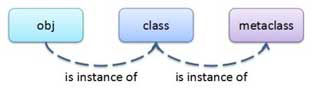
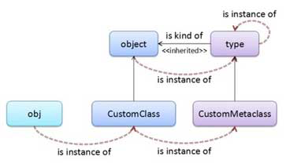
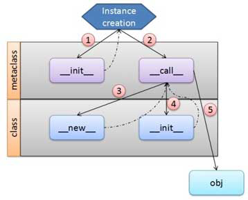

# metaclass的原理
## 内置函数type()
有两个主要的功能：  
* 查看一个变量（对象）的类型  
当传入一个参数时，返回这个对象的类型
```python
class classA:
    name = "type test"

a = classA()
b = 3.0

print(type(a)) # <class '__main__.classA'>
print(type(b)) # <class 'float'>
print(a.__class__) # <class '__main__.classA'>
print(b.__class__) # <class 'float'>
```
这个时候type()通常与object.__class__的功能相同，都是返回对象的类型
* 创建一个类（class）  
当传入三个参数时，用来创建一个类
```
源码
class type(name, bases, dict)
name: 要创建的类的类型
bases: 要创建的类的基类，python中允许多继承，因此这个一个tuple元组类型
dict: 要创建的类的属性，是一个dict字典类型
```
```python
ClassVariable = type('ClassA', (object,), dict(name = "type test"))
a = ClassVariable()
print(type(a)) # <class '__main__.ClassA'>
print(a.name) # type test
```
通常，我们都是用class xxx来定义一个类的；但是type()函数也允许我们动态的创建一个类。  
python是一种解释型的动态语言，动态语言与静态语言最大的区别是，可以方便的在运行期间动态的创建类。  
## isinstance()
判断一个对象是不是某个类型的示例
```
isinstance(object, classinfo)
object: 要判断的对象
classinfo：期望的类型
```
如果object是classinfo的一个实例或者classinfo子类的一个实例，则返回True
```python
class BaseClass:
    name = "base"

class SubClass(BaseClass):
    pass

base = BaseClass()
sub = SubClass()

print(isinstance(base, BaseClass)) # True
print(isinstance(base, SubClass)) # False
print(isinstance(sub, BaseClass)) # True
print(isinstance(sub, SubClass)) # True
```
如果想知道子类与父类之间的继承关系，可用issubclass()方法或object.__bases__方法
```
print(issubclass(SubClass, BaseClass)) # True SubClass继承了BaseClass
print(issubclass(BaseClass, SubClass)) # False
print(SubClass.__bases__) # (<class '__main__.BaseClass'>,)
```
## metaclass
metaclas直译为元类，可控制类的属性和类实例的创建过程。  
python中，一切都可以是对象：一个整数、一串字符串、一个类实例、类本身都是对象。  
一个类也是一个对象，他是元类（metaclass）的一个实例.  
对象、类、元类的关系,如图  

```python
class MyClass:
    pass

m = MyClass()
print(type(MyClass)) # <class 'type'>
print(type(m)) # <class '__main__.MyClass'>
print(isinstance(m, MyClass)) # True
print(isinstance(MyClass, type)) # True
```
默认的metaclass是type类型的，所以我们看到MyClass的类型是type。（MyClass是metaclass的一个实例）  
type在python中是一个极为特殊的类型。为了彻底理解metaclass，我们先搞清楚type与object的关系。  
### type与object的关系
在python3中，object是所有类的基类，内置的类、自定义的类都直接或间接的继承自object类。如果去看源码，会发现type类也继承自object类。这对
我们的理解造成了极大的困扰，主要变现在一下三点：
* type是一个metaclass，而且是一个默认的metaclass。也就是说，type是object的类型，object是type的一个实例
* type是object的一个子类，继承object的所有属性和行为
* type还是一个callable,即实现了__call__方法，可以当成一个函数使用。  
用一张图来解释type与object的关系  
  
type与object有点像"蛋生鸡"与"鸡生蛋"的关系，type是object的子类， 同时object又是type的一个实例（type是object的类型），二者是不可分离的  
type的类型也是type,先记住吧。  
我们可以自定义metaclass，自定义的metaclass必须继承自type。  
一般来说，类class的类型为type(即一般的类的metaclass是type,是type的一个实例)。如果要改变类的metaclass，必须在定义类时
显示地指定他的metaclass  
```python
class CustomMetaClass(type):
    pass

class CustomClass(metaclass=CustomMetaClass):
    pass

print(type(object)) # <class 'type'>
print(type(type)) # <class 'type'>
obj = CustomClass()
print(type(CustomClass)) # <class 'CustomMetaClass'>
print(type(obj)) # <class '__main__.CustomClass'>
print(isinstance(obj, CustomClass)) # True
print(isinstance(obj, object)) # True
```
### 自定义metaclass
注意：  
* object的__init__方法只有1个参数，但自定义的metaclass的__init__有4个参数  
object的__init__方法只有1个参数：def __init__(self),但type重写了__init__方法，有4个参数：def __init__(cls, what, bases=None, dict=None):  
因为自定义metaclass继承自type,所以重写__init__方法时也要4个参数
* 对于普通的类，重写__call__方法说明对象是callable的。在metaclass中__call__方法还负责对象的创建。  
对象的创建过程，如图  
  
图中每一条实线都表示具体操作，每一条虚线表示返回的过程。  
结合实例代码看：  
```python
class CustomMetaClass(type):

    def __init__(cls, what, bases=None, dict=None):
        print("CustomMetaClass.__init__ cls:", cls)
        super().__init__(what, bases, dict)

    def __call__(cls, *args, **kwargs):
        print("CustomMetaClass.__call__ args:", args, kwargs)
        self = super(CustomMetaClass, cls).__call__(*args, **kwargs)
        print("CustomMetaClass.__call__ self:", self)
        return self

class CustomClass(metaclass=CustomMetaClass):

    def __init__(self, *args, **kwargs):
        print("CustomClass.__init__ self:", self)
        super().__init__()

    def __new__(cls, *args, **kwargs):
        self = super().__new__(cls)
        print("CustomClass.__new__ self:", self)
        return self

    def __call__(self, *args, **kwargs):
        print("CustomClass.__call__ args:", args)


obj = CustomClass("Meta arg1", "Meta arg2", kwarg1=1, kwarg2=2)
print(type(CustomClass))
print(obj)
obj("arg1", "arg2")

"""
CustomMetaClass.__init__ cls: <class '__main__.CustomClass'>

CustomMetaClass.__call__ args: ('Meta arg1', 'Meta arg2') {'kwarg1': 1, 'kwarg2': 2}

CustomClass.__new__ self: <__main__.CustomClass object at 0x7fab068435e0>

CustomClass.__init__ self: <__main__.CustomClass object at 0x7fab068435e0>

CustomMetaClass.__call__ self: <__main__.CustomClass object at 0x7fab068435e0>

<class '__main__.CustomMetaClass'>

<__main__.CustomClass object at 0x7fab068435e0>

CustomClass.__call__ args: ('arg1', 'arg2')
"""

```
实例对象的整个创建过程大致是这样的：  
1. metaclass.__init__进行一些初始化的操作，如一些全局变量的初始化
2. metaclass.__call__创建实例，在创建的过程中会调用class的__new__和__init__方法
3. class.__new__进行具体的实例化的操作，并返回实例对象obj（0x7fd0d9a435e0）
4. class.__init__对返回的实例对象obj(0x7fd0d9a435e0)进行初始化，如一些状态和属性的设置
5. 返回一个用户真正需要使用的对象obj(0x7fd0d9a435e0)  
到这里我们应该知道了，通过metaclass几乎可以自定义一个对象生命周期的各个过程。
